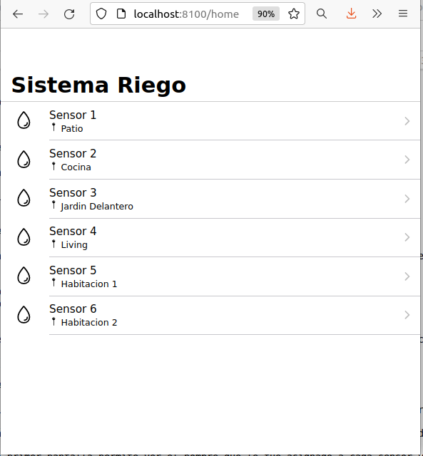
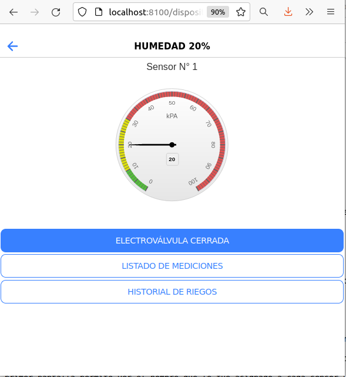
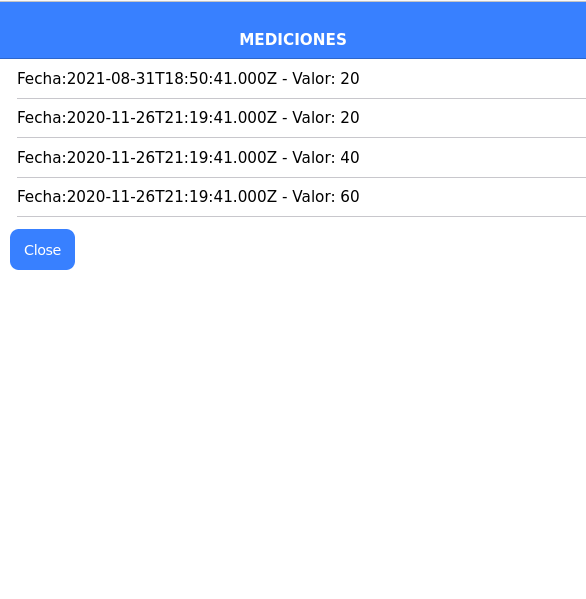
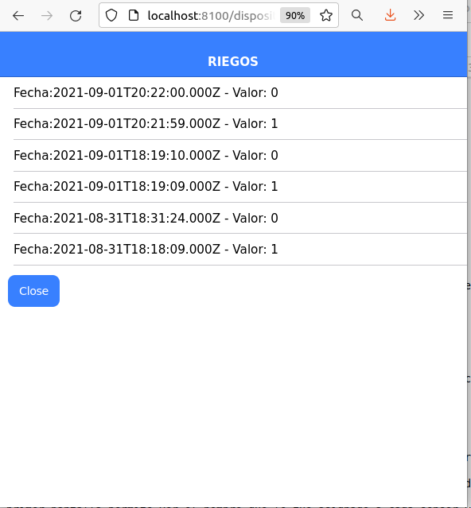

Trabajo Práctico de Desarrollo de Aplicaciones Multiplataforma
===========================================================
## Tema : Sistema de Riego Automatizado.
El trabajo es la simulación de un sistema de riego. La aplicación permitirá mostrar un listado de los dispositivos disponibles en el sistema, conocer el valor actual de humedad de cada dispositivo y su historial, operar la válvula de agua de cada dispositivo y conocer su historial de operación.

### Instrucciones de puesta en marcha
A continuación se dan las instrucciones para poner rápidamente el sistema en marcha. Mas detalle de las tecnologías utilizadas pueden consultarse mas adelante en este documento.
#### 1) Levantar el backend.
* Instalar docker y docker-compose (en la sección backend de detalla como instalarlo).
* Desde la raíz ejecutar en la terminal de linux docker-compose up ( se deberá ver el mensaje *"API TP DAM corriendo OK!"*)

#### 2) Ejecutar el frontend.
* Instalar NodeJs y el gestor de paquetes npm
    Desde una consola linux
        sudo apt-get install nodejs
        sudo apt-get install npm

* Instalar Angular e Ionic
    Desde la consola ejecutar los siguientes comandos:
        npm install -g @angular/cli
        npm install -g @ionic/cli

* Instalar la carpeta node_modules
    Dirigirse a la carpeta frontend y desde una consola ejecutar
        npm install
        

* Iniciar la aplicación
    Dirigirse a la carpeta frontend y desde una consola ejecutar
        ionic serve

Esta última operación abrirá un navegador en http://localhost:8100 

Frontend
======================
El frontend se desarrollo con las herramientas Ionic y Angular.
La primera pantalla presenta una lista de dispositivos, el nombre asignado y su ubicación:

Haciendo click en un elemento de la lista, la aplicación nos lleva a la página del dispositivo.

Se observa un manómetro analogico con el valor de humedad del suelo y los botones para abrir/cerrar la vávula, ver el historial de mediciones y de operaciones de la válvula.

Cada vez que se opere la válvula se registrará esa operación y se simulará una medición que también será registrada,

Backend
======================
El backend es el encargado de gestionar y disponibilizar los datos almacenados en la base de datos para que puedan ser consumidos o modificados por el frontend.
El backend de este proyecto toma como base el proyecto **Web App Full Stack Base**, de la web www.gotoiot.com

Este backend se correrá en un ecosistema Docker compuesto por varios contenedores. El primero es el compilador TypeScript, el segundo es un servidor NodeJs y finalmente una base de datos MySql.
Para administrar estos contenedores se utiliza docker compose, el cual nos permite cargar e inicializar todo lo necesario al ejecutar el script que se encuentra en el archivo docker-compose.yml.

En la carpeta **db/dumps** se encuentra el archivo `estructuraTPDAM-phpmyadmin.sql` que es un script de mysql que crea la base de datos y la inicializa con las tablas necesarias. Además hace la carga de algunos elementos para comenzar a operar y poder hacer consultas. Esta operación se ejecuta al iniciar docker-compose.

En la carpeta **backend** se encuentra todo lo necesario para que NodeJs disponibilice un Servicio Web que permita a nuestra aplicación acceder a la base de datos.

## Preparando el sistema
### Instalar dependencias
Instalar Docker y Docker Compose.
Te recomiendo que sigas las instrucciones de instalación para un ambiente linux que se encuentran en:
https://www.gotoiot.com/pages/articles/docker_installation_linux/index.html
Aquí encontrarás todo lo necesario para instalar ambos programas.
### Ejecutar el Backend
Para ejecutar la aplicación tenes que correr el comando `docker-compose up` desde la raíz del proyecto. Este comando va a descargar las imágenes de Docker de node, de typescript, de la base datos y del admin de la DB, y luego ponerlas en funcionamiento. Los datos generados se encuentran en la carperta db/data, el nombre de la base de datos es "DAM".

#### 1) Base de datos
Para esta aplicación se usa **PHPMyAdmin**, que es un administrador de base de datos web muy utilizado y que podés utilizar en caso que quieras realizar operaciones con la base, como crear tablas, modificar columnas, hacer consultas y otras cosas más.
Para acceder al admin de la DB accedé a [localhost:8001/](http://localhost:8001/). En el login del administrador, el usuario para acceder a la db es `root` y contraseña es la variable `MYSQL_ROOT_PASSWORD` del archivo `docker-compose.yml`.Si pudiste acceder al administrador significa que la aplicación se encuentra corriendo bien. 
Podrás observar la estructura de la base de datos, como asi también los datos con que se inicializó.

#### 2) El servicio web
El servicio en **NodeJS** posee distintos endpoints para comunicarse con el cliente web mediante requests HTTP enviando **JSON** en cada transacción. Procesando estos requests es capaz de comunicarse con la base de datos para consultar y controlar el estado de los dispositivos, y devolverle una respuesta al cliente web también en formato JSON. Así mismo el servicio es capaz de servir el código del cliente web.
Para analizar la estructura de este servicio, debemos referirnos a los archivos que se encuentran en las carpetas mysql y rutas.
En la primera tenemos mysql-connectors.js, que contiene el script de conexión a la base de datos servida por MySql. En este caso se utiliza un pool de conexiones (límite 10).
En la segunda encontraremos los scripts para operar con las tablas de la BD, denominadas dispositivo, medición y riego.

## Tecnologías utilizadas 🛠️

En esta sección podés ver las tecnologías más importantes utilizadas.

<b>Mira la lista completa de tecnologías</b>
 

* [Docker](https://www.docker.com/) - Ecosistema que permite la ejecución de contenedores de software.
* [Docker Compose](https://docs.docker.com/compose/) - Herramienta que permite administrar múltiples contenedores de Docker.
* [Node JS](https://nodejs.org/es/) - Motor de ejecución de código JavaScript en backend.
* [MySQL](https://www.mysql.com/) - Base de datos para consultar y almacenar datos.
* [PHPMyAdmin](https://www.phpmyadmin.net/) - Administrador web de base de datos.
* [Material Design](https://material.io/design) - Bibliotecas de estilo responsive para aplicaciones web.
* [TypeScript](https://www.typescriptlang.org/) - Superset de JavaScript tipado y con clases.

## Autor 👥

* **[Agustín Rey](https://github.com/agusrey/TpDAM)**: Creación, puesta en marcha y mantenimiento del proyecto.

## Licencia 📄

Este proyecto está bajo Licencia ([MIT](https://choosealicense.com/licenses/mit/)). Podés ver el archivo [LICENSE.md](LICENSE.md) para más detalles sobre el uso de este material.